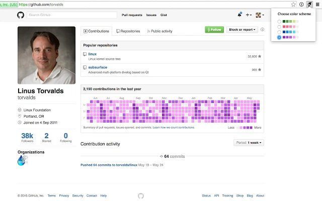

# colorGit
_Make your GitHub more colorful!_

The [Chrome](https://www.google.com/chrome/) extension which makes your gihtub tiles more colorful! 💖

## Installation
You can install it via [Chrome web store](https://chrome.google.com/webstore/detail/colorgit/mgmdjgnaodbpkoanmdbblaflilnhalig?hl=ko).

## Credits
See [Contributors](../../graphs/contributors).

## License
colorGit is under the [GPLv2](LICENSE).

Copyright (c) 2016 Dohyun Kim
